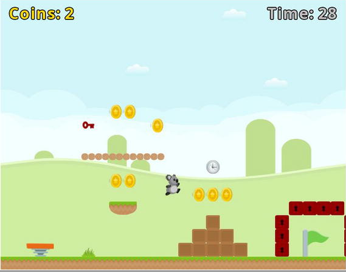

# Jumping Jack

**Game live coding**: https://www.youtube.com/watch?v=nYEqX4XkKXM

Jumping Jack is an action game where the character, Jack the Koala, jumps around a level collecting as many coins as possible; he must reach the goal flag before time runs out.

**Controls**

- Left and Right key: walk
- Space bar: jump
- Space bar + Down key: get off the platform

## Setup

- **Java** 8
- **Gradle** Wrapper 6.7.1
- **LigGDX** 1.9.13: https://github.com/libgdx/libgdx
- **GDX Liftoff** 1.9.13: https://github.com/tommyettinger/gdx-liftoff

## Disclaimer

This "framework" is the result of reading, studying and learning the examples shown in the book "**Java Game Development with LibGDX**" by the author Lee Stemkoski.

- **Book site**: https://www.apress.com/gp/book/9781484233238
- **Source-code**: https://github.com/Apress/java-game-dev-LibGDX